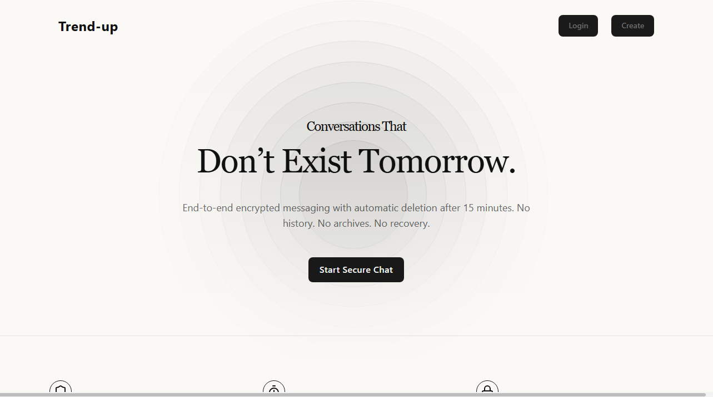

# 🚀 Trend Up — Real-Time Chat Application

<p align="center">
  <a href="https://trendup.tanishtirpathi.me" target="_blank">
    
  </a>
</p>

<p align="center">
  <a href="https://trendup.tanishtirpathi.me">
    
  </a>
  <a href="https://github.com/tanishtirpathi">
    
  </a>
  
  
</p>

---

## 💬 About Trend Up

**Trend Up** is a modern real-time chat application built with the MERN stack and powered by WebSockets using Socket.io.

It supports:
- Real-time messaging
- Live online presence
- Image sharing
- Unread message indicators
- Responsive UI
- Clean chat layout

Built with performance, responsiveness, and simplicity in mind.

---

## 🧠 Tech Stack

### ⚡ Frontend
- React
- Tailwind CSS
- Axios
- Socket.io Client

### 🔥 Backend
- Node.js
- Express.js
- MongoDB
- Socket.io

### 🌐 Real-Time Engine
- WebSockets via Socket.io

---

## ✨ Features

- 🔐 Authentication system
- 🟢 Live user status (online/offline)
- 📩 Real-time messaging
- 🖼 Image upload in chat
- 🔔 Unread message badges
- 📱 Fully responsive (mobile optimized)
- ⚡ Instant message updates via WebSockets

---

## 🗂 Project Structure
Frontend/
├── components/
├── pages/
├── libs/
└── store/

server/
├── controllers/
├── models/
├── routes/
├── middleware/
└── config/


---

## 🛠 Getting Started

### 1️⃣ Clone the repository

```bash
git clone https://github.com/tanishtirpathi/trend-up

```

### Install dependencies
```bash
cd Frontend
npm install
```
### Install backend
```bash
cd Backend
npm install
```

## Setup Environment Variables

| Create a .env file in the server folder: 
```bash 
PORT=
MONGODB_URL=
ACCESS_TOKEN_EXPIRES_IN=
REFRESH_TOKEN_EXPIRES_IN=
JWT_SECRET=
CLOUDINARY_CLOUD_NAME=
CLOUDINARY_API_KEY=
CLOUDINARY_API_SECRET=
REFRESH_TOKEN_SECRET=
GOOGLE_CLIENT_ID=


```

## 🌍 Live Website

👉 https://trendup.tanishtirpathi.me


## 📊 Development Activity

This project is actively maintained and improved.
Recent updates include:
- UI responsiveness improvements
- Chat performance optimizations
- Real-time event refinement
- Mobile UX improvements

### View commit history:
👉 https://github.com/tanishtirpathi/trend-up/commits/main


## 📸 Preview
<p align="center">  </p>


## 🚀 Deployment

Frontend deployed on Vercel

Backend deployed with Node environment

MongoDB hosted in cloud

## 📬 Connect

🌐 Live: https://trendup.tanishtirpathi.me

💻 GitHub: https://github.com/tanishtirpathi


